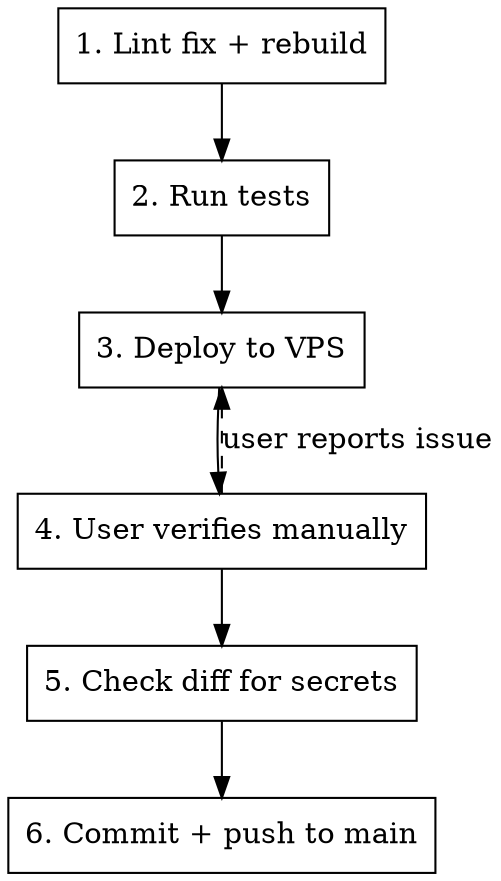

# Deploy to VPS

Deploy workflow for immo-locator. Every phase must complete before moving to the next. Never skip steps or reorder.

## Workflow



### 1. Lint fix + rebuild

```bash
npm run lint:fix
npm run build:ext   # only if extension files changed
```

Fix any pre-existing lint errors on touched files so the pre-commit hook won't block.

### 2. Run tests

```bash
npm test
```

Run the full test suite. If tests fail, fix before proceeding. Never deploy with failing tests.

### 3. Deploy to VPS

```bash
./packages/api/deploy/deploy.sh
```

The script rsyncs files, installs deps, restarts PM2, and runs a health check. Requires `packages/api/deploy/.env` (not committed).

### 4. User verifies manually

**STOP.** Ask the user to verify on the VPS. Do NOT proceed until they confirm it works.

If the user reports an issue, fix it and restart from step 1.

### 5. Check diff for secrets

```bash
git diff origin/main..HEAD
```

Scan the full diff for:

- API keys, tokens, passwords
- `.env` values or private IPs
- SSH keys or credentials
- Any string that looks like a secret

If anything suspicious is found, flag it to the user and do NOT proceed.

### 6. Commit and push to main

```bash
git add <specific files>
git commit -m "<message>"
git push origin main
```

**Rules:**

- Push directly to `main`. Never create branches or PRs unless the user explicitly asks.
- Add specific files — never `git add -A` or `git add .`
- Wait for user confirmation before pushing.

## Red Flags — STOP

- Pushing before user confirms the deploy works
- Using `git add .` or `git add -A`
- Creating a branch or PR without being asked
- Skipping the secrets check
- Committing `.env`, credentials, or deploy config
