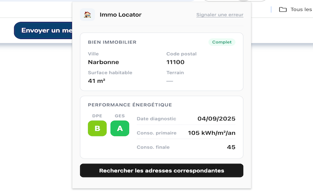

# Immo Locator

Extension navigateur (Chrome/Firefox) qui enrichit les annonces immobilières [Leboncoin](https://www.leboncoin.fr/) avec les données officielles de diagnostic énergétique (DPE/GES) issues de la base [ADEME](https://data.ademe.fr/), permettant de retrouver l'adresse réelle d'un bien.



## Fonctionnement

1. L'utilisateur ouvre une annonce Leboncoin et clique sur l'icône de l'extension
2. L'extension extrait automatiquement les données du bien (surface, DPE, GES, localisation, consommation énergétique) via 3 stratégies complémentaires :
   - Parsing du JSON `__NEXT_DATA__` embarqué par Next.js
   - Scraping DOM en fallback
   - Analyse visuelle des badges DPE/GES par comparaison de styles CSS
3. Ces données sont envoyées à l'API backend qui interroge la base ADEME des diagnostics énergétiques
4. Les résultats sont affichés avec un score de correspondance et un lien Google Maps vers l'adresse trouvée

## Structure du projet

Monorepo npm workspaces :

```
packages/
├── extension/   # Extension Chrome/Firefox (Manifest V3)
└── api/         # API backend Node.js (Express 5)
```

| Package                          | Stack                        | Description                                                        |
| -------------------------------- | ---------------------------- | ------------------------------------------------------------------ |
| [extension](packages/extension/) | Manifest V3, esbuild, Vitest | Extraction des données Leboncoin, UI popup, communication API      |
| [api](packages/api/)             | Express 5, SQLite, Zod, Pino | Proxy ADEME avec cache LRU, circuit breaker, scoring des résultats |

## Installation

### Prérequis

- Node.js 20+
- npm 10+

### Setup

```bash
git clone https://github.com/clementbichel/immo-locator.git
cd immo-locator
npm install
```

### Extension

```bash
npm run build:ext                # Bundle src/ → popup.js
```

Puis charger l'extension en mode développeur :

- **Chrome :** `chrome://extensions/` → Mode développeur → Charger l'extension non empaquetée → sélectionner `packages/extension/`
- **Firefox :** `about:debugging#/runtime/this-firefox` → Charger un module temporaire → sélectionner `packages/extension/manifest.json`

### API

```bash
cp packages/api/.env.example packages/api/.env   # Remplir les variables
npm run dev:api                                    # Démarrage avec hot reload
```

Variables d'environnement requises :

| Variable             | Description                                             |
| -------------------- | ------------------------------------------------------- |
| `ADEME_API_URL`      | URL de l'API ADEME Data Fair                            |
| `CORS_CHROME_ORIGIN` | Origin de l'extension Chrome (`chrome-extension://...`) |
| `PORT`               | Port du serveur (défaut : 3000)                         |

## Tests

```bash
npm test                # Tous les tests (extension + API)
npm run test:ext        # Tests extension uniquement
npm run test:api        # Tests API uniquement
npm run test:watch      # Mode watch
```

## Stack technique

**Extension :**

- Manifest V3 — Chrome + Firefox (cross-browser)
- esbuild — bundler IIFE
- Vitest — tests unitaires, intégration, E2E
- ESLint + Prettier

**API :**

- Express 5 — framework HTTP
- SQLite (better-sqlite3) — analytics et rapports d'erreur
- Zod — validation stricte des entrées
- Pino — logging structuré JSON
- lru-cache — cache réponses ADEME (500 entrées, TTL 1h)
- Circuit breaker — résilience API ADEME (3 échecs → 30s cooldown)
- Helmet + rate limiting — sécurité

**Déploiement :**

- PM2 + Nginx reverse proxy + Let's Encrypt
- fail2ban sur Nginx

## Sécurité

- Pas de `innerHTML` — manipulation DOM via `textContent` et `createElement`
- CSP stricte dans le manifest
- CORS explicite (pas de wildcard)
- Validation Zod `.strict()` sur tous les endpoints
- Prepared statements SQL
- Rate limiting : 30 req/min global, 20 req/min sur la recherche
- Payload limité à 10 KB
- Rétention des données : 90 jours, purge automatique

## Liens

- [Chrome Web Store](https://chromewebstore.google.com/detail/immo-locator/okglkdgbdbnikojffmjpodmakgjmlpda)
- [Politique de confidentialité](packages/extension/docs/privacy.html)
- [API ADEME — Dataset DPE](https://data.ademe.fr/datasets/dpe03existant)

## Licence

[AGPL-3.0](packages/extension/LICENSE)
